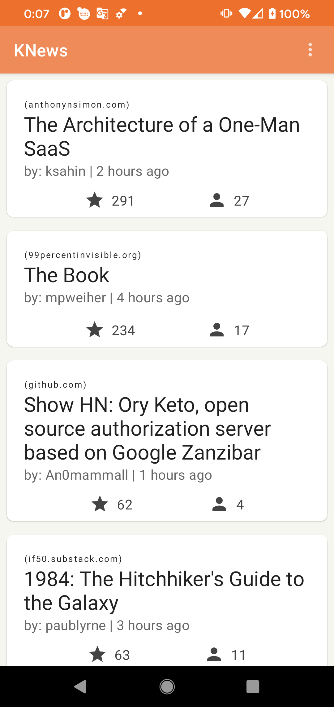
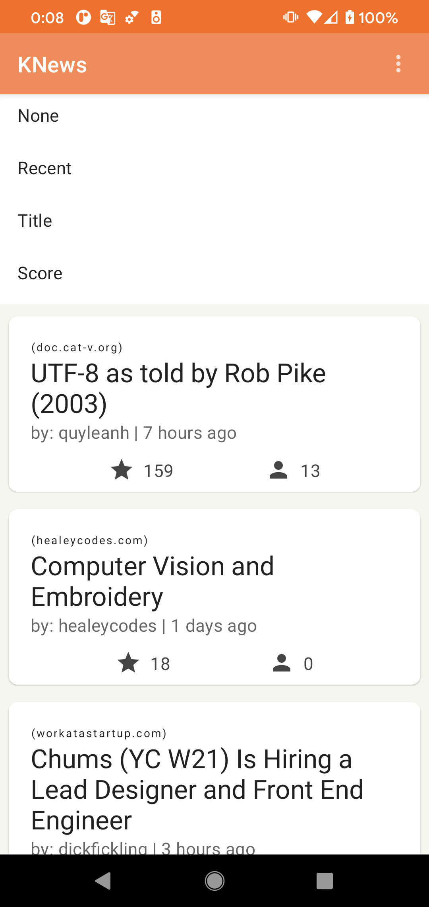
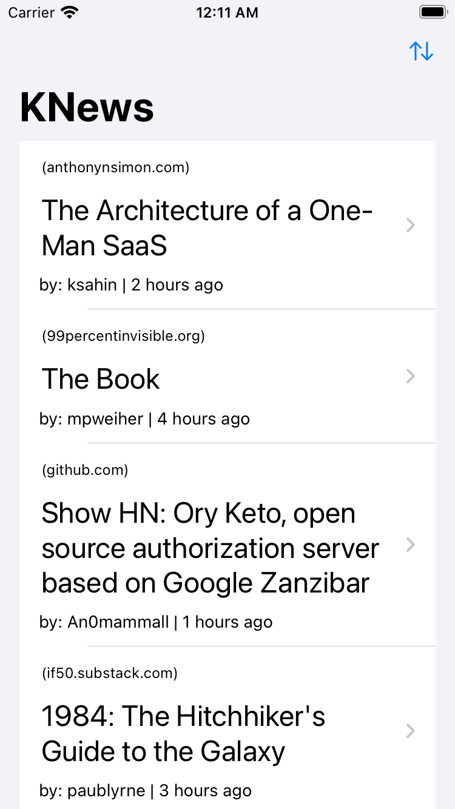
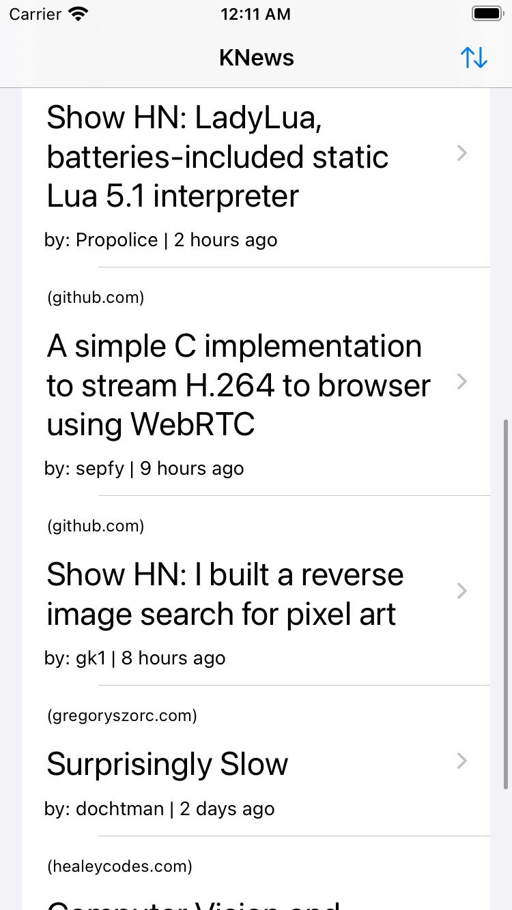
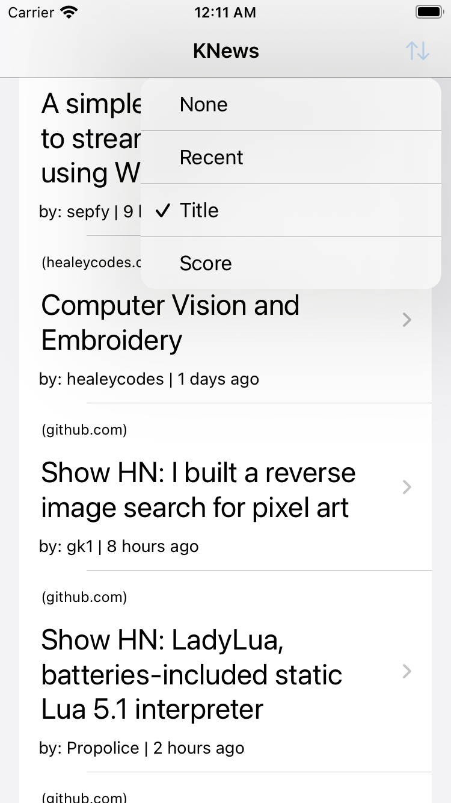
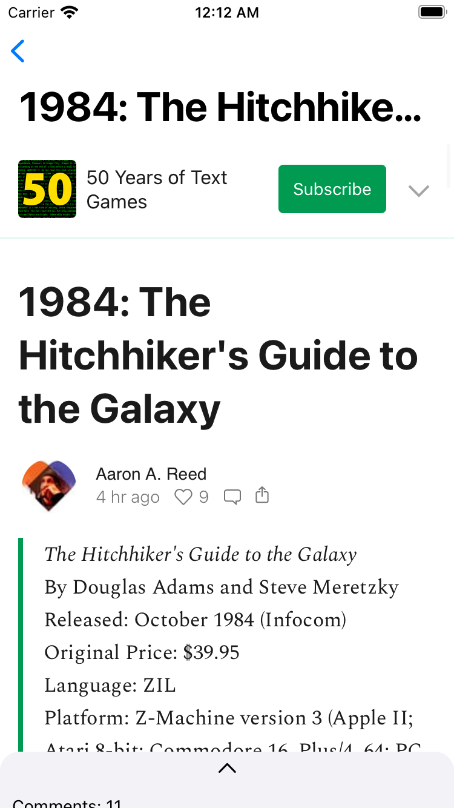

# KNews

The goal of this project is to build mobile apps that
consumes [HackerNews API](https://github.com/HackerNews/API) with Kotlin Multi-Platform technology.

## About

My idea is to build 2-page simple mobile applications (for both iOS and Android :) ). We want to
build something relatively complex enough that can represent the real-world example-ish app that
also comprises of the quality of modern mobile app architecture which is implemented/powered by
Kotlin Mutli-platform Mobile

## Project structure

The project comprises of the following modules which aims to be modularized for easier to maintain
in the future.

The top level overview project structure is the following;

```
.
├── KNews-android
│ ├── build.gradle.kts
│ ├── libs
│ │ ├── hackernews-debug-xxx.aar (*)
│ │ └── hackernews-release-xxx.aar (*)
│ └── src
│     ├── androidTest
│     ├── main
│     └── test
├── KNews-ios
│ └── KNews
│     ├── KNews
│     └── KNews.xcodeproj
├── README.md
├── build.gradle.kts
├── libs
│ ├── hackernews
│ │   ├── XCFrameworks
│ |        └── debug
│ |            └── HackerNews-debug.xcframework (*)
│ |        └── release
│ |            └── HackerNews-release.xcframework (*)
│ │   ├── build.gradle.kts
│ │   └── src
└── settings.gradle.kts
```

For the big picture, there are 2 main parts, the first one is the app modules (this includes both
iOS and Android app named [KNews-ios](KNews-ios) and [KNew-android](KNews-android), respectively).
The second one is the libs modules. Inside of the [libs](libs) modules contains 1 module that
contain a domain-specific library which relates to HackerNews API.

The core of the HackerNews library uses my interpretation of redux implementation in KMP
named [CoRed](https://github.com/kittinunf/CoRed).

(*) is the final artifacts that can be used by the App which are `.aar` and `.xcframework` for debug
and release buildType that will be finally consumed by the application layer for both iOS and
Android app.

### App modules

Both app modules use modern/declarative/cutting-edge UI toolkit that is available at this moment to
develop the UI related part. They
are [Jetpack Compose](https://developer.android.com/jetpack/compose) for building Android app (
KNews-android) and [SwiftUI](https://developer.apple.com/xcode/swiftui/) for iOS app (KNews-ios).
They are simple yet powerful toolkit for driving modern apps' UI. Both libraries are backed by
modern Kotlin and Swift programming languages.

### Library modules (Libs)

Libs module is a heart of the application where most of the logic reside. Even though this is such a
simple app with 2 screens (List & Detail). There are a little interesting bit of architectural
design inside due to the nature HackNews API where the API is quite barebones. Some of the
interesting things are, for example, the list is comprise of calling multiple APIs. One for getting
the feed items and multiple calls more by getting the detail of the items' id provided by the first
API. This is not the best API to consume but it is interesting and good amount of challenge to do
some business logic.

Due to the fact that we want to build both iOS & Android apps. It would be too-time consuming and
too much duplicate code if we were to write the "core" library part twice in 2 programming
languages. One in Swift and the other in Kotlin. Luckily, Kotlin has a multi-platform feature that
can transpile/compile the Kotlin code down to the native code for Darwin. This is called a
Kotlin/Native which is altogether it is called [KMP](https://kotlinlang.org/docs/multiplatform.html)
. The core of this app used this technique to be able to achieve the fact that we want to share the
core part of our mobile app upto the ViewModel layer which will be described in the next section.

### App Architecture

Heart and soul of the application lies in the library hackernews (`libs/hackernews`) which is
powered by [CoRed](https://github.com/kittinunf/CoRed).

CoRed is basically a [Redux](https://redux.js.org/introduction/getting-started) implementation in
Kotlin KMP technology. As we want to have the best way to manage the state, we follow closely the
Redux paradigm that is proven to be working by the web front-end technology.

```none
┌──────────────┐    ┌──────────────┐
│ Android App  ├────|   iOS App    │       Application layer (UI) (Kotlin/Swift)
└───────▲──────┘    └──────▲───────┘
   aar* │                  │ framework*
┌──────────────────────────────────┐
│         HackerNews (libs)        │       Library layer (Core)
└──────────────────────────▲───────┘
                           │        
                    ┌──────┴───────┐
                    │ Redux (libs) │       Library layer (CoRed)
                    └──────────────┘
```

Inside with our app, we use simple MVVM architecture where VM hold a single source of truth of the
screen and how the UI should look like. The output from the core layer is a single stream that
represents the UI state that UI can subscribed to. On the iOS side, it is unfortunately needed to be
wrapped by the thin layer called ViewModelWrapper.

#### MVVM

#### The ViewModel

* Android 🤖

The update stream is being abstracted with a class that represents a value over time
called ["State"](https://developer.android.com/jetpack/compose/state) which resides in our ViewModel
which lies in the code module libs/hackerNews (we can use it directly straight from the core lib).

Whenever the State object is updated with our UI state that is published from our core layer. The
Compose UI's State is updated, then the UI will be rendered accordingly (and re-render as the state
is updated).

Core's ViewModels (i.e. HackerNewsListViewModel and HackerNewsDetailViewModel)

```kotlin
internal fun ListStore(scope: CoroutineScope, environment: ListEnvironment): Store {
    return createStore(
        scope = scope,
        initialState = ListUiState(),
        reducers = mapOf(
            LoadNextStoriesReducer(),
            LoadStoriesReducer(),
            SortReducer(),
            ResultActionReducer()
        ),
        middlewares = mapOf(
            LoadStoriesEffect(environment, listUiRowStateMapper),
            LoadNextStoriesEffect(environment, listUiRowStateMapper)
        )
    )
}

class HackerNewsDetailViewModel(private val service: HackerNewsService) : NativeViewModel() {

    private val store by lazy {
        ListStore(scope, ListEnvironment(scope, HackerNewsRepositoryImpl(service)))
    }

    @Suppress("Unused")
    val currentState
        get() = store.currentState

    val states = store.states
}
```

* UI for Android

```kotlin
val viewModel =
    viewModel<HackerNewsListViewModel>(factory = HackerNewsListViewModelFactory(service))
val states = viewModel.states.collectAsState()
val stories = states.stories

// update UI according to the states changes with compose UI
```

The `collectAsState()` is a Kotlin compose extension that convert the Coroutine's flow (in our case
it is StateFlow) into the State object that can be updated by Jetpack's Compose UI toolkit.

* iOS 🍎

The update is being abstracted with the help of Apple's reactive solution
called [Combine](https://developer.apple.com/documentation/combine) library. The key components that
make the Swift UI toolkit update the view tree accordingly are the `ObservableObject`
and `@Published`. This represent with a ViewModel wrapper layer (eg. For the list screen, it
is `HackerNewsListViewModelWrapper` and for detail screen it is `HackerNewsDetailViewModelWrapper`).

```swift
class HackerNewsListViewModelWrapper: ObservableObject {

    private let viewModel: HackerNewsListViewModel

    @Published var state: ListUiState

    private var cancellable: AnyCancellable?

    init(service: HackerNewsService) {
        viewModel = HackerNewsListViewModel(service: service)

        state = viewModel.currentState 

        cancellable = viewModel.states
            .toAnyPublisher()
            .assign(to: \.state, on: self)
    }
}
```

* UI for iOS

```swift
@ObservedObject var viewModel: HackerNewsListViewModelWrapper
let stories = viewModel.state.stories 

// Update the UI according to the states changes with SwiftUI
```

As you can see now that we have converged things to the point where things are pretty similar on
both iOS and Android, we are publishing something that will change over time from the core library.
Then, we convert them into the abstraction data type that can react to our UI toolkit (Jetpack
Compose and SwiftUI)

To recap, this is the table represents what we are discussing so far.

```none
┌──────────────────────────────────┐
│            Application           │
└─────────────────▲────────────────┘
 @Published (iOS) │ State<T> (Android)
                  │          ▲
                  │          │
┌──────────────────┐         │
│ VM Wrapper (iOS) │         │  We can use VM directly for (Android)
└─────────▲────────┘         │  convert to State<T> with collectAsState()
          │                  │
          │ StateFlow<T>     │
┌──────────────────────────────────┐
│             ViewModel            │
└──────────────────────────────────┘
```

| Core | Android  | iOS |
| ---- | -------- | --- |
| [Flow<T>](https://kotlinlang.org/docs/flow.html) | [State<T>](https://developer.android.com/jetpack/compose/state) | [@ObservedObject](https://developer.apple.com/documentation/swiftui/observedobject) (consumer-side) and [@Publish](https://developer.apple.com/documentation/combine/published/) (producer-side) |

For the List screen specifically, the T type variable will be substituted with our defined "state"
object which is `ListUiState` which is hidden in our KMP (which is able to generate for iOS and
Android usage 🎉) module.

#### What's inside VM

In our VM, as our application grows managing state in a plain code could be very challenging. Our VM
is powered by predictable state handling strategy which is known as Redux. The idea behind Redux is
simple. Make the state changes as confined / specific as much as possible through the help of Redux
abstraction, eg. Reducer. We will be discussing about this more in detail inside
Redux's [README](https://github.com/kittinunf/CoRed/blob/main/README.md) file.

```none

                           ▲           ─┐
                           │            │ 
┌──────────────────────────┴───────┐    │ 
│             ViewModel            │    │     
└───────┬──────────────────▲───────┘    │     
        │                  │            │     KMP Module
┌───────▼──────┐    ┌──────┴───────┐    │  
│    Action    ├────▶    Store     │    │  
└──────────────┘    └──────────────┘    │ 
                                       ─┘
```

Inside our View is a Redux's store, that encode how we interact with our store with `Action`, then
we use the Action to mutate our `State` in a pure function called `Reducer`. In the `Reducer`, we
define how our `Action` will change our `State`. If we want to interact with the external
dependency (such as interact with side-effect), we can use `Middleware` to do so.

## Dependencies

As one of the main goal of this project, we are trying to minimize the 3rd party dependencies used
in this project. However, the big ones are the ones from Kotlin team like Kotlin standard library
and Kotlinx (Kotlin extension).

### Core (Kotlin related)

- Kotlin standard library + Kotlinx Time
- Kotlin coroutines
- Kotlin serialization (for JSON Serialization/Deserialization)
- Ktor (Network libraries)

#### Android

- Ktor (for Android) with Okhttp for Networking
- MaterialDesign
- Core KTX (Kotlin extension)
- Jetpack compose
- AndroidX lifecycle related libraries

#### iOS

- Ktor (for iOS) with NSURLSession for Networking
- SwiftUI

## How to build

Just to simplify the build process and the way that we work with core libraries, we have created
[Makefile](./Makefile) so it is easier to execute command from the CLI (underneath it is used the
gradlew command). This make task will also run tasks like compile, build and verify tests then
generate the final artifact(s) for you.

Also, due to the fact that we use newer version of Gradle for Jetpack compose support, you will need
a canary version of Android Studio (2020.3.1 or later) if you want to sync/build the project with
IDE;

E.g. This is the environment that we currently use as of April 2021.

### Android Studio

```
Android Studio Arctic Fox | 2020.3.1 Beta 2
Build #AI-203.7717.56.2031.7375522, built on May 19, 2021
Runtime version: 11.0.10+0-b96-7281165 x86_64
VM: OpenJDK 64-Bit Server VM by JetBrains s.r.o.
macOS 10.15.7
GC: G1 Young Generation, G1 Old Generation
Memory: 3072M
Cores: 16
Registry: external.system.auto.import.disabled=true
```

### Xcode

```
Xcode

Version 12.4 (12D4e)
```

For clean:

```shell
make clean
```

For building only core libraries:

```shell
make lib
```

For building for Android app:

```shell
make android
```

For install and launch Android app:

```shell
make install_android
```

Please make sure that you have `adb` install in your path. If you don't know how, please consult
this SO's [answer](https://stackoverflow.com/questions/17901692/set-up-adb-on-mac-os-x).

For building for iOS app:

```shell
make ios
```

The output will be something like the following, this means that the `.xcframework` is generated
correctly.

```shell
xcframework successfully written out to: KNews/libs/hackernews/build/bin/ios/HackerNews-debug.xcframework
xcframework successfully written out to: KNews/libs/hackernews/build/bin/ios/HackerNews-release.xcframework
```

In the case, you can't install the iOS app from the command line (either you don't want to or you
don't have necessary xcode-install tool), please move to
the [.pbxproj](KNews-ios/KNews/KNews.xcodeproj), then you should be able to run the iOS on Xcode
like usual.

For install iOS app: (with the command-line tool)

```shell
make install_ios
```

The `make install_ios` command is also build the app and install into the iPhone 11, iOS 14.4 as
described in the Makefile `-destination 'platform=iOS Simulator,name=iPhone 11,OS=14.4' \`. You will
need to launch the app by yourself however. Make sure that you have such simulator ready or the
installation will be failed.

### Android App

#### ListScreen





#### DetailScreen


### iOS App

#### ListScreen





#### DetailScreen



